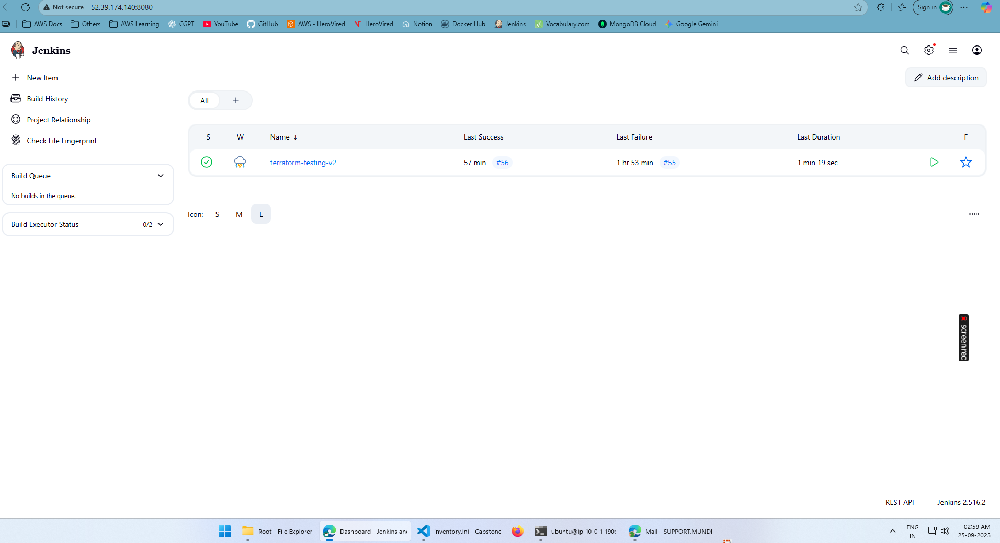
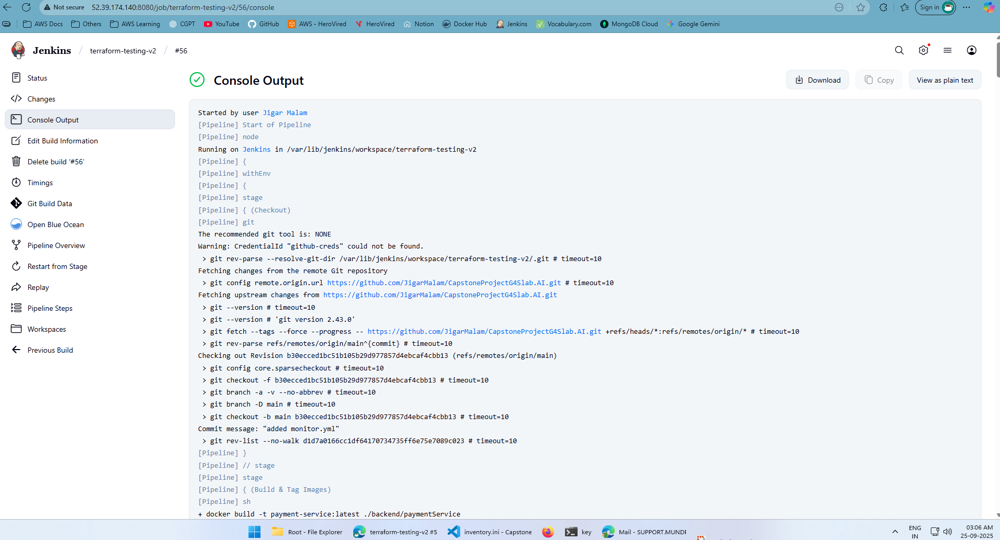
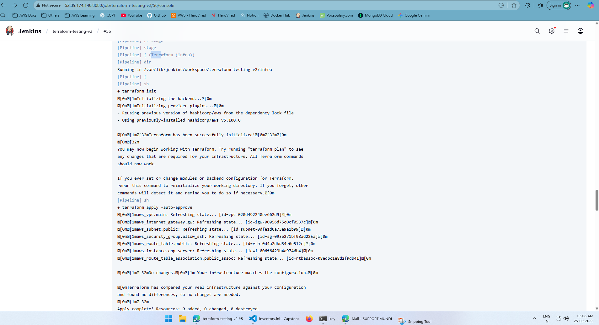
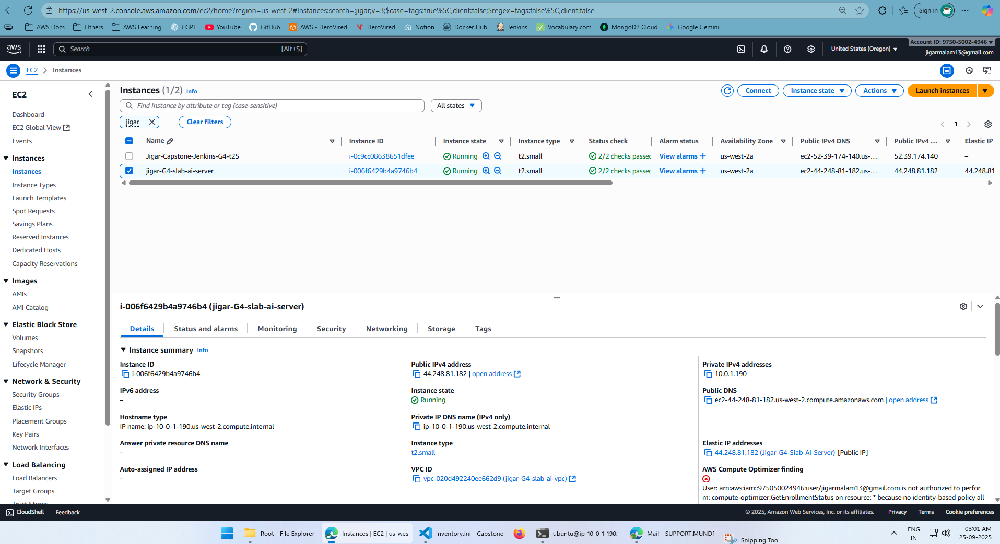
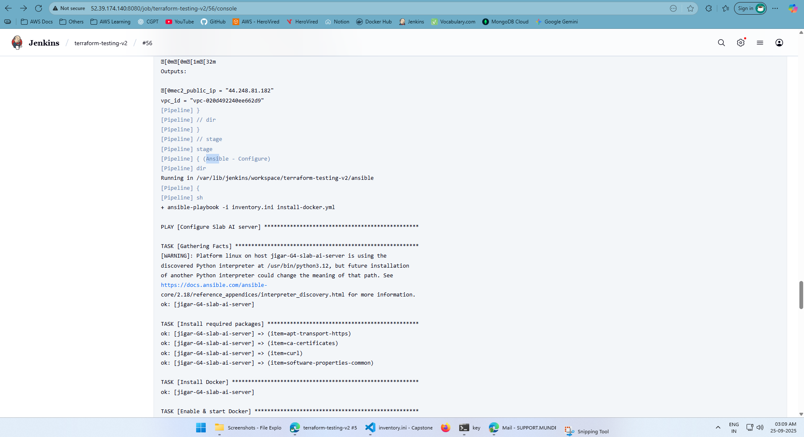
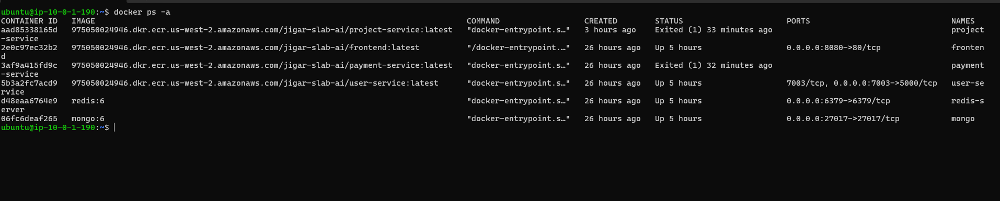
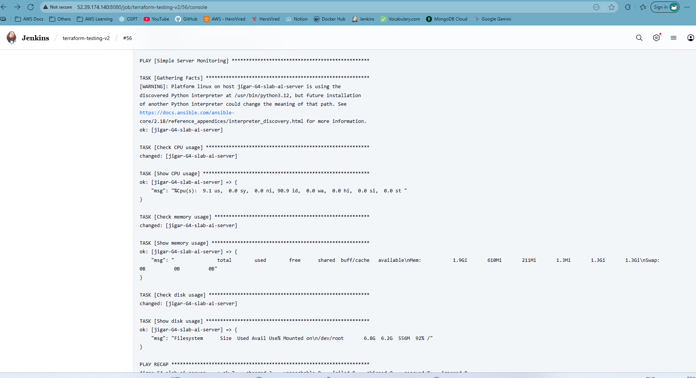
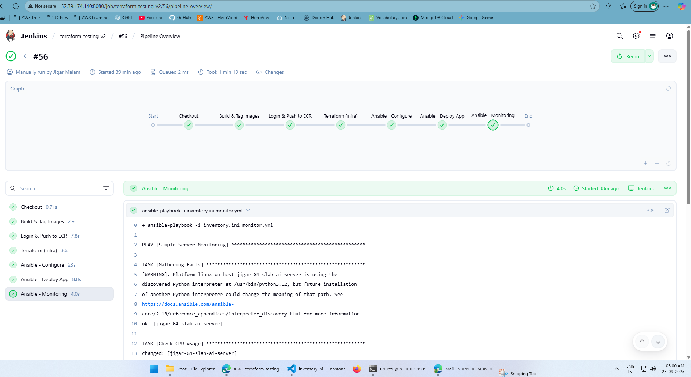

# Capstone Project: End-to-End DevOps Pipeline

## Project Overview
This project demonstrates an **end-to-end DevOps pipeline** for deploying a web application using CI/CD on AWS.  
We are building a fully automated flow using Jenkins, Terraform, Ansible, Docker, Kubernetes (EKS), and monitoring tools (Prometheus + Grafana).  

**Value Statement:**  
Automating build, provisioning, deployment, and monitoring for scalable cloud applications with minimal manual intervention.

---

## Steps Completed So Far

### **Step 1: Jenkins Setup**
- Installed Jenkins on an Ubuntu EC2 instance.
- Installed Java and configured Jenkins to run on port `8080`.
- Retrieved initial admin password and accessed Jenkins UI.

### **Step 2: Install Docker**
- Installed Docker on Jenkins server.
- Added Jenkins user to Docker group for permission.
- Verified with `docker ps`.

### **Step 3: Jenkins Plugins Setup**
- Installed plugins: Pipeline, Docker Pipeline, Kubernetes CLI, AWS Credentials, GitHub.
- Configured global tools (Git, Docker).

### **Step 4: GitHub & AWS Integration**
- Added GitHub credentials into Jenkins.
- Configured Jenkins to pull code from GitHub repo: `Slab.ai`.
- Added AWS credentials into Jenkins (via IAM User with Access/Secret keys).
- Installed AWS CLI and verified with `aws sts get-caller-identity`.

### **Step 5: Terraform via Jenkins**
- Created `infra/` folder with Terraform files:
  - `provider.tf` → AWS provider setup.
  - `variables.tf` → Variables for flexibility.
  - `main.tf` → Provisioned VPC, Subnet, Security Group, EC2 instance.
  - `outputs.tf` → Output EC2 public IP and VPC ID.
- Created Jenkins pipeline job for Terraform provisioning:
  - Stages: Init → Plan → Apply.
- Successfully provisioned:
  - **EC2 instance (`slab-ai-server`)**
  - **S3 bucket**
- EC2 is currently a **blank Ubuntu 22.04 server** (no software installed yet).

---

## Text-Based Architecture Diagram (So Far)

```
                          ┌─────────────────────────────┐
                          │         Developers          │
                          │  (Code Push to GitHub Repo) │
                          └──────────────┬──────────────┘
                                         │
                                         ▼
                          ┌─────────────────────────────┐
                          │          Jenkins            │
                          │ (CI/CD Orchestrator on EC2) │
                          └───────┬─────────┬───────────┘
                                  │         │
        ┌─────────────────────────┘         └─────────────────────────┐
        │                                                       │
        ▼                                                       ▼
┌─────────────────────┐                                ┌───────────────────────┐
│    Terraform         │                                │       Ansible         │
│ (Provision AWS: VPC, │                                │ (Config Management:   │
│  Subnets, EC2, S3)   │                                │  install Docker,      │
│                      │                                │  kubectl, deps)       │
└──────────┬──────────┘                                └───────────┬───────────┘
           │                                                      │
           ▼                                                      ▼
   ┌──────────────────┐                                  ┌───────────────────┐
   │ AWS Infrastructure│                                  │   Configured      │
   │ (EC2, VPC, S3)    │                                  │   AWS Nodes       │
   └─────────┬─────────┘                                  └─────────┬─────────┘
             │                                                      │
             ▼                                                      ▼
   ┌──────────────────┐                                    ┌──────────────────┐
   │   Docker Build    │                                    │ Kubernetes (EKS) │
   │ (Next Step:       │                                    │ (Future Stage)   │
   │  Jenkins builds   │                                    │                  │
   │  & pushes image   │                                    │                  │
   │  to AWS ECR)      │                                    │                  │
   └──────────────────┘                                    └──────────────────┘
```

---

## ScreenShots

| Description | Screenshot |
|---|---|
| Jenkins Home Page |  |
| Jenkins Console Output |  |
| Terraform Apply Output |  |
| EC2 Instances in AWS Console |  |
| Ansible Playbook Run |  |
| Docker Containers Running on EC2 |  |
| Application Running in Browser |  |
| Monitoring Dashboard |  |
| Pipeline Architecture Diagram |  |